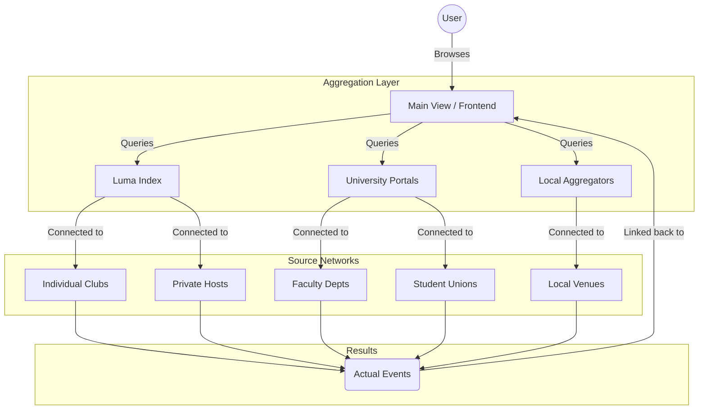

# KWNetwork

KWNetwork is a modern event aggregation and discovery platform for the Kitchener-Waterloo region, specifically designed for students at the University of Waterloo and Wilfrid Laurier University.

## Purpose
The platform acts as a unified index for student life, pulling events from multiple fragmented sources (Luma, wat2go, UW Events, Laurier Events, and Eventbrite) into a single, high-craft interface. KWNetwork prioritizes attribution and discovery, serving as a gateway to the original event organizers while providing a seamless browsing experience.

## Architecture

KWNetwork operates as a specialized aggregation layer. It connects to primary event platforms, which in turn aggregate from individual organizers and clubs, finally surfacing the actual event results to the user.



## Tech Stack
- **Frontend:** Next.js (App Router)
- **Styling:** Tailwind CSS (v4)
- **Animations:** Framer Motion
- **Icons:** Lucide React

## Getting Started

First, install the dependencies:

```bash
npm install
```

Then, run the development server:

```bash
npm run dev
```

Open [http://localhost:3000](http://localhost:3000) with your browser to see the result.
